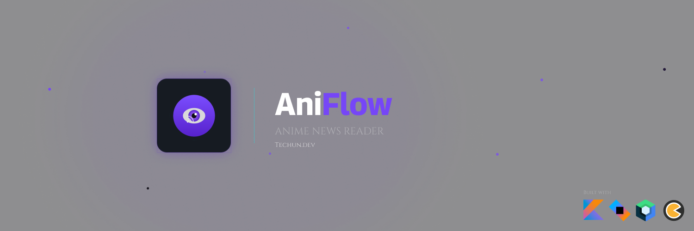
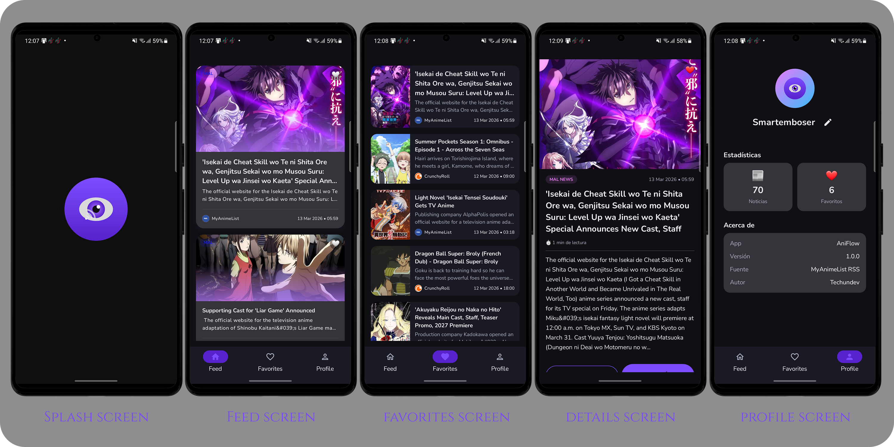

<p align="center">
  
</p>

<p align="center">
  
  
  
  
  
</p>

<br/>

# 🎌 AniFlow — Anime News Reader

Una aplicación de noticias de anime con soporte multi-fuente (MyAnimeList + Crunchyroll), favoritos y modo offline, desarrollada en Android con Jetpack Compose por [Techun.dev](https://github.com/TechUn-GT).

---

## 📱 Pantallas

| Pantalla | Descripción |
|---|---|
| **Home** | Feed de noticias con paginación, pull to refresh y badge por fuente (MAL / CR) |
| **Detail** | Detalle completo de la noticia con noticias relacionadas y opción de abrir el enlace original |
| **Favorites** | Lista de noticias guardadas de forma persistente |
| **Profile** | Perfil del usuario con estadísticas y configuración de nombre y avatar |

### 🖼️ Vista previa

<p align="center">
  
</p>

---

## 📰 Fuentes de Noticias

- **MyAnimeList (MAL)** — `https://myanimelist.net/rss/news.xml`
- **Crunchyroll (CR)** — `https://www.crunchyroll.com/rss/anime`

Ambas fuentes se obtienen en paralelo y se identifican con un badge de color en cada tarjeta:
- 🟣 **MAL** — morado
- 🟠 **CR** — naranja

---

## 🏗️ Arquitectura

El proyecto implementa **Clean Architecture** con el patrón **MVVM** y **Unidirectional Data Flow (UDF)**, organizado con una estructura **Feature-first**.

```
app/
├── feature/
│   ├── feed/
│   │   ├── data/         → RssRemoteDataSource, FeedRepositoryImpl
│   │   ├── domain/       → GetFeedUseCase, SyncFeedUseCase, GetNewsPagedUseCase
│   │   └── presentation/ → FeedScreen, FeedViewModel
│   ├── favorites/
│   │   ├── data/         → FavoritesRepositoryImpl
│   │   ├── domain/       → AddFavoriteUseCase, RemoveFavoriteUseCase, GetFavoritesUseCase
│   │   └── presentation/ → FavoritesScreen, FavoritesViewModel
│   ├── detail/
│   │   └── presentation/ → DetailScreen, DetailViewModel
│   └── profile/
│       ├── data/         → UserPreferencesDataStore, ProfileRepositoryImpl
│       ├── domain/       → GetUserPreferencesUseCase, GetProfileStatsUseCase
│       └── presentation/ → ProfileScreen, ProfileViewModel
│
└── core/
    ├── components/       → AniFlowText, AniFlowAsyncImage, AniFlowCardFeed, AniFlowTagBadge
    ├── database/         → AniFlowDatabase, FeedDao, FavoritesDao
    ├── model/            → RssSource, NavRoutes
    ├── di/               → DatabaseModule, AppModule
    └── utils/            → DateFormatter, ReadingTime
```

---

## 🛠️ Stack Tecnológico

| Categoría | Tecnología |
|---|---|
| **Lenguaje** | Kotlin |
| **UI** | Jetpack Compose + Material 3 |
| **Arquitectura** | Feature-first + MVVM + Clean Architecture + UDF |
| **Inyección de dependencias** | Koin |
| **Red** | Ktor Client (OkHttp engine) |
| **RSS Parser** | Rome |
| **Persistencia** | Room Database |
| **Preferencias** | DataStore Preferences |
| **Imágenes** | Coil |
| **Asincronía** | Coroutines + Flow |
| **Navegación** | Navigation 3 |

---

## 📦 Casos de Uso

| UseCase | Descripción |
|---|---|
| `GetFeedUseCase` | Obtiene el feed de noticias desde Room como Flow |
| `SyncFeedUseCase` | Sincroniza las noticias desde MAL y Crunchyroll en paralelo |
| `GetNewsPagedUseCase` | Obtiene noticias paginadas con limit y offset |
| `GetNewsItemByIdUseCase` | Obtiene una noticia por su ID |
| `GetFavoritesUseCase` | Obtiene la lista de favoritos guardados |
| `GetFavoriteIdsUseCase` | Obtiene los IDs de favoritos como Flow |
| `AddFavoriteUseCase` | Agrega una noticia a favoritos |
| `RemoveFavoriteUseCase` | Elimina una noticia de favoritos |
| `GetUserPreferencesUseCase` | Obtiene las preferencias del usuario |
| `UpdateUserNameUseCase` | Actualiza el nombre del usuario |
| `UpdateAvatarUrlUseCase` | Actualiza el avatar del usuario |
| `GetProfileStatsUseCase` | Obtiene estadísticas del perfil (total noticias y favoritos) |

---

## ⚙️ Configuración del Proyecto

### Requisitos

- Android Studio Hedgehog o superior
- Kotlin 2.0+
- minSdk 24
- targetSdk 36

### Instalación

1. Clona el repositorio:
```bash
git clone https://github.com/techundev/AniFlow.git
```

2. Abre el proyecto en **Android Studio**.

3. Sincroniza las dependencias de Gradle.

4. Ejecuta la app en un emulador o dispositivo físico con Android 7.0 (API 24) o superior.

### Dependencias principales

```kotlin
// Jetpack Compose
implementation(platform("androidx.compose:compose-bom:2025.x.x"))

// Ktor
implementation("io.ktor:ktor-client-android:3.x.x")
implementation("io.ktor:ktor-client-okhttp:3.x.x")

// Room
implementation("androidx.room:room-runtime:2.7.x")
implementation("androidx.room:room-ktx:2.7.x")

// Koin
implementation(platform("io.insert-koin:koin-bom:4.x.x"))
implementation("io.insert-koin:koin-android:4.x.x")
implementation("io.insert-koin:koin-compose:4.x.x")

// DataStore
implementation("androidx.datastore:datastore-preferences:1.1.x")

// Coil
implementation("io.coil-kt.coil3:coil-compose:3.x.x")

// Rome RSS
implementation("com.rometools:rome:2.x.x")

// Navigation 3
implementation("androidx.navigation3:navigation3-runtime:1.x.x")
```

---

## 📥 Descarga

¿Quieres probar la app sin compilar el proyecto? Descarga directamente el APK:

[](https://github.com/techundev/AniFlow/releases/tag/v1.0.0)

> **Nota:** Es necesario habilitar la instalación de fuentes desconocidas en tu dispositivo Android.  
> `Ajustes → Seguridad → Instalar apps desconocidas`

---

## 👨‍💻 Desarrollador

Desarrollado por [Techun.dev](https://github.com/TechUn-GT).

---

## 📄 Licencia

Este proyecto es de uso personal y de libre consulta. Desarrollado por [Techun.dev](https://github.com/TechUn-GT).
